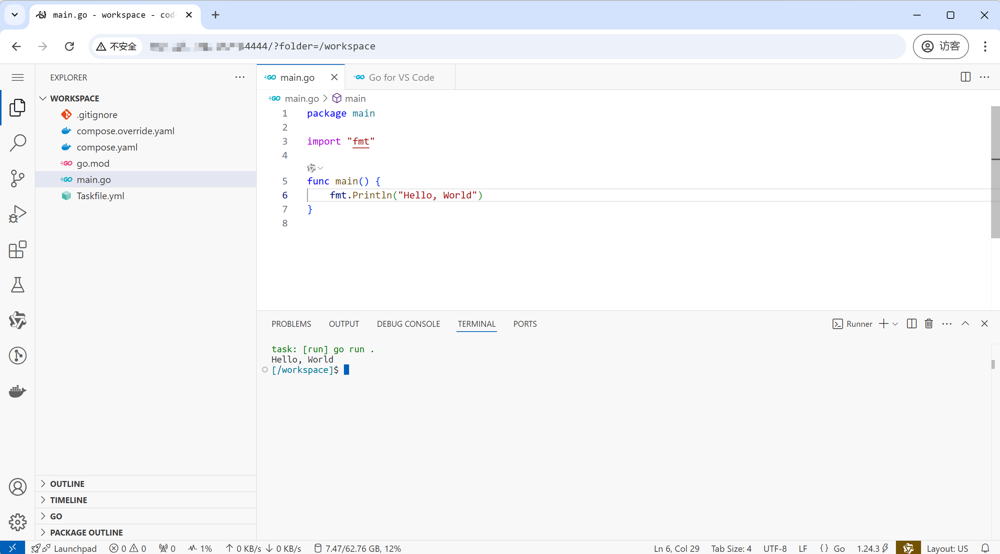
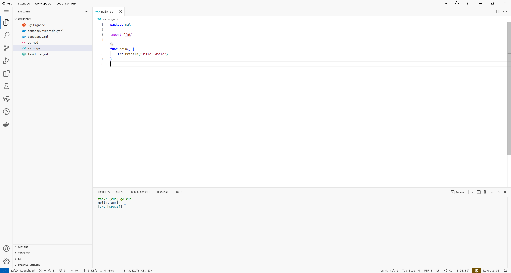

# docker-dev

适用于开发的 Docker 镜像

## 快速开始

拉取镜像

```sh
docker pull 117503445/dev

# China mirror
docker pull registry.cn-hangzhou.aliyuncs.com/117503445-mirror/dev && docker image tag registry.cn-hangzhou.aliyuncs.com/117503445-mirror/dev 117503445/dev
```

运行容器

```sh
docker run -it -v $PWD:/workspace 117503445/dev
```

## 核心理念

开发环境搭建往往是一个烦人的问题。

常规的做法是直接在系统上安装各种开发工具和环境，但这样存在以下缺点

- 缺乏隔离性，系统中/其他项目的依赖可能会影响到本项目的运行。
- 缺乏可复现性。就算用文档/脚本记录了操作，换台电脑可能就失败了，或者过几个月也自动失效了。

所以必须把开发环境放在容器里，具有以下优点

但为什么要把 IDE 也放在容器中呢？为什么不用 VSCode Remote / Dev Containers 呢？因为开发机上的 VSCode 必然是不断升级的，最终会与版本停滞的项目不兼容。比如项目使用了 Go 1.17，但是 VSCode 不断升级，导致 Go 扩展的版本也不断升级，最后升级的 Go 扩展就无法兼容。

然后就是 IDE 也放在容器中的话，对开发者比较方便。一行命令启动开发容器后，然后在浏览器中打开，不需要再去考虑本地装 VSCode、装拓展、改设置了。可以增强团队开发环境的一致性。

然后要进一步收敛开发工具。比如 API 调用，常用 Postman，但是每个人自己配置的话就比较麻烦。可以替换为 `humao.rest-client` 拓展。而且这个拓展鼓励将 API 调用放在一个单独的文本文件中，方便Git 管理。

## 进阶用法

### 安装软件包

通过以下命令临时安装所需的软件包

```sh
# 使用 pacman 安装 Go
pacman -Sy --noconfirm go

# 切换到 builder 用户并使用 yay 安装 Scala
su - builder -c "yay -Su scala --noconfirm"
```

**建议：** 更推荐将软件包的安装步骤写入 `Dockerfile` 中，以确保构建过程的透明性和可重复性。参考 `examples/exp1`。

### code-server

访问容器的 4444 端口即可使用 code-server，在 WebIDE 中进行开发。

可以设置 `CODE_SERVER_PASSWORD` 环境变量来设置密码。

讲脚本映射到容器的 `/entrypoint` 可以自定义启动命令

## 实现

在 `dev/Dockerfile` 中定义了镜像的构建步骤。其中

  - Code Server 的配置、插件安装见 [vsc-init](https://github.com/117503445/vsc-init)
  - Entrypoint 见 `./entrypoint/main.go`，其中流程为
    - 修改 Code Server 源代码，以优化 PWA 下的体验
    - 将 `CODE_SERVER_PASSWORD` 环境变量写入 Code Server 的配置文件
    - 在后台启动 Code Server
    - 如果以 `--it` 启动容器，则进入 Shell；否则调用 `tail -f /dev/null` 防止容器退出

在 `.github/workflows/dev.yml` 中使用 GitHub Actions 定时构建镜像

## 例子

在 examples 目录下，提供了一些例子

### `examples/exp0` - 使用 Docker Compose

相比 `docker run`，建议使用 Docker Compose

```yaml
# compose.yaml
services:
  dev:
    image: 117503445/dev
    restart: unless-stopped
    volumes:
      - ./:/workspace
```

常用操作

```sh
docker compose up -d # 启动容器
docker compose exec dev zsh # 进入容器 Shell
```

### `examples/exp1` - 自定义镜像

每个项目往往会有自己的需求，可以自定义镜像

```yaml
# compose.yaml
services:
  dev:
    build:
      dockerfile: dev.Dockerfile
    restart: unless-stopped
    volumes:
      - ./:/workspace
```

在 `dev.Dockerfile` 中添加进一步的配置

```dockerfile
# dev.Dockerfile
FROM 117503445/dev

RUN pacman -Sy --noconfirm go
```

### `examples/exp2` - SHA256 锁定镜像

`117503445/dev` 镜像每天都会更新，安装最新的软件。为了防止新版本软件与老项目不兼容，可以将项目开发时所使用的镜像进行锁定。

```yaml
# compose.yaml
services:
  dev:
    image: 117503445/dev@sha256:342935c6d952acaef3149f4219761a9d433356172a9e7c9263e31bfb9f8aef7c
    restart: unless-stopped
    volumes:
      - ./:/workspace
```

### `examples/exp3` - Docker in Docker

在项目开发中，有时会依赖 Docker 来提供完整的开发环境。一种常见的做法是，在 Docker 容器内通过挂载 `docker.sock` 来访问宿主机上的 Docker 守护进程。这种方式虽然简便，但存在一些局限性和潜在问题：

- 当使用 `-v` 参数进行卷映射时，路径是相对于宿主机的，而不是容器内部的路径，容易导致路径混乱或配置错误。
- 容器运行依赖于宿主机的 Docker 环境，这会引入环境耦合，导致在不同机器上行为不一致，影响可移植性和环境一致性。

因此，一个更加优雅且隔离性更强的方案是使用 **Docker-in-Docker(DinD)**。即：在容器内部运行自己的 `dockerd` 服务，完全独立于宿主机的 Docker 环境。这样可以避免对宿主机造成影响，提升环境的一致性和安全性。

```yaml
# compose.yaml
services:
  dev:
    image: 117503445/dev
    volumes:
        - ./:/workspace
        - ./scripts/entrypoint.sh:/entrypoint
        - docker:/var/lib/docker
    privileged: true
volumes:
  docker:
```

```sh
#!/usr/bin/env sh
# ./scripts/entrypoint.sh

dockerd
```

常用操作

```sh
docker compose exec dev docker info # 查看容器内的 Docker 守护进程信息
```

### `examples/exp4` - CUDA

开发 AI 项目时，需要使用 CUDA。

首先确保宿主机已安装 NVIDIA 驱动和 `nvidia-container-toolkit`

```yaml
# compose.yaml
services:
  dev:
    image: 117503445/dev
    volumes:
        - ./:/workspace
    deploy:
      resources:
        reservations:
          devices:
            - driver: nvidia
              count: 1
              capabilities: [gpu]
```

其他 Python 工程文件见 `exp4` 目录。容器内可使用具有 CUDA 加速的 Pytorch

```sh
docker compose exec dev uv run main.py
```

输出

```
torch.cuda.is_available: True
```

### `examples/exp5` - DinD CUDA

Dind(Docker in Docker) 同样可以使用 CUDA

```yaml
services:
  dev:
    build:
      dockerfile: dev.Dockerfile
    volumes:
        - ./:/workspace
        - ./scripts/entrypoint.sh:/entrypoint
        - docker:/var/lib/docker
    privileged: true
    deploy:
      resources:
        reservations:
          devices:
            - driver: nvidia
              count: 1
              capabilities: [gpu]
volumes:
  docker:
```

```dockerfile
# dev.Dockerfile
FROM 117503445/dev

RUN pacman -Sy --noconfirm nvidia-container-toolkit
```

验证

```sh
# 1. 进入容器 Shell
docker compose exec dev zsh
# 2a. 验证 DinD 是否可以使用 CUDA
docker run --rm -it --gpus=all nvcr.io/nvidia/k8s/cuda-sample:nbody nbody -gpu -benchmark
# 2b. 使用国内镜像
docker run --rm -it --gpus=all registry.cn-hangzhou.aliyuncs.com/117503445-mirror/sync:linux.amd64.nvcr.io.nvidia.k8s.cuda-sample.nbody nbody -gpu -benchmark
```

### `examples/exp6` - 使用 Code Server 和 go-task

Code Server 是一个基于 VS Code 的浏览器端 IDE。`117503445/dev` 镜像内置了 Code Server，开发者在任何一台设备的浏览器上都可以访问开发环境。

```yaml
# compose.yaml
services:
  dev:
    image: 117503445/dev
    restart: unless-stopped
    ports:
      - "4444:4444"
    volumes:
      - ./:/workspace
```

在 `compose.override.yaml` 中注入 `CODE_SERVER_PASSWORD` 环境变量。在实际项目中，可以将 `compose.override.yaml` 放入 `.gitignore` 中，避免 Code Server 密码泄露。

```yaml
# compose.override.yaml
services:
  dev:
    environment:
      - CODE_SERVER_PASSWORD=K8bDE57LaAp0vp
```

在浏览器中输入 `http://SERVER_IP:4444`，即可访问 Code Server。



`go-task` 是一个 Go 编写的命令运行器。详情见 [go-task documentation](https://taskfile.dev/usage/)。

```yaml
# Taskfile.yml
version: '3'

tasks:
  default:
    desc: "The default task" 
    cmds:
      - clear
      - task: run
      
  run:
    cmds:
      - go run .
  
  build:
    cmds:
      - go build .
```

在 Code Server 中，按下 F5，即可在终端中运行 `go-task`，也就是 `go run .`。

### `examples/exp7` - 满血 Code Server

当前 `exp6` 示例中通过宿主机端口访问容器内的 Code Server（如 `http://SERVER_IP:4444`），在同时运行多个项目容器时存在以下几个主要问题：

- 安全上下文限制

  使用 IP 地址加端口号访问属于 **非安全上下文（insecure context）**，无法启用剪贴板功能和 PWA（渐进式 Web App）。只有在使用 `localhost` 或 `https` 协议时，浏览器才允许启用这些高级特性。

  其中，PWA 模式下才能支持完整的快捷键操作（如 `Ctrl + W` 关闭标签页），缺少该模式会显著影响开发体验。
- 端口冲突

  每个容器都需要手动指定一个宿主机端口，容易造成端口冲突，尤其在并行运行多个开发容器时管理成本较高。
- 语义不清晰

  通过端口号难以直观识别其对应的具体项目。

一种常见的替代方式是使用 SSH 端口转发，将容器中的 Code Server 映射到开发机本地的 `localhost`，从而启用剪贴板和 PWA 功能。然而，这种方式依然无法解决后两个问题（端口管理和语义不清），并且每次使用容器前都需手动启动 SSH 转发，操作繁琐。

最理想的方式是：当容器启动后，自动为其分配一个唯一的 HTTPS 域名，实现便捷、统一、无感知的访问。例如，启动名为 `project0` 的开发容器后，可以通过如下地址直接访问 Code Server：

```
https://vsc-project0.117503445.top
```

为了实现这一点，可以进行以下流程

1. 参考 [中小型应用运维](https://wiki.117503445.top/practice/中小型应用运维)，在公网云服务器上配置 Traefik 网关，支持泛域名 HTTPS 和基于 Host 的路由。
2. 参考 [traefik-provider-frp: 将 frps 代理信息提供给 Traefik，从而实现自动反向代理](https://zhuanlan.zhihu.com/p/26025560346)，在公网服务器上部署 `frps` 和 `traefik-provider-frp` 服务，使 Traefik 能够自动发现 frp 隧道并为其创建子域名和反向代理规则。
3. 参考 [frpc-controller: 基于 Docker Labels 自动生成 frpc 配置文件](https://zhuanlan.zhihu.com/p/26026511814)，在运行容器的开发服务器上运行 `frpc-controller`，根据 Docker 容器的 Label 自动生成 frpc 配置，实现隧道连接的自动化管理。

然后可以很简单地编写 Docker Compose

```yaml
# compose.yaml
services:
  dev:
    image: 117503445/dev
    restart: unless-stopped
    volumes:
      - ./:/workspace
```

```yaml
services:
  dev:
    environment:
      - CODE_SERVER_PASSWORD=K8bDE57LaAp0vp
    networks:
      - frp
    labels:
      - frpc.vsc-exp7=4444

networks:
  frp:
    external: true
```

启动容器后，即可通过 https 域名访问容器，并可以启用 PWA



启用 PWA 后，Code Server 的使用体验几乎与本地 VSCode 保持一致，包括快捷键、剪贴板等功能。

## `examples/exp8` - 通义灵码

通义灵码是一款很好用的 AI 辅助编码工具，需要持久化 `/root/.lingma` 和 `/root/.cache`，以防止重建容器后登录信息丢失。

```yaml
# compose.yaml
services:
  dev:
    image: 117503445/dev
    restart: unless-stopped
    volumes:
      - ./:/workspace
      - lingma:/root/.lingma
      - cache:/root/.cache
volumes:
  lingma:
  cache:
```
